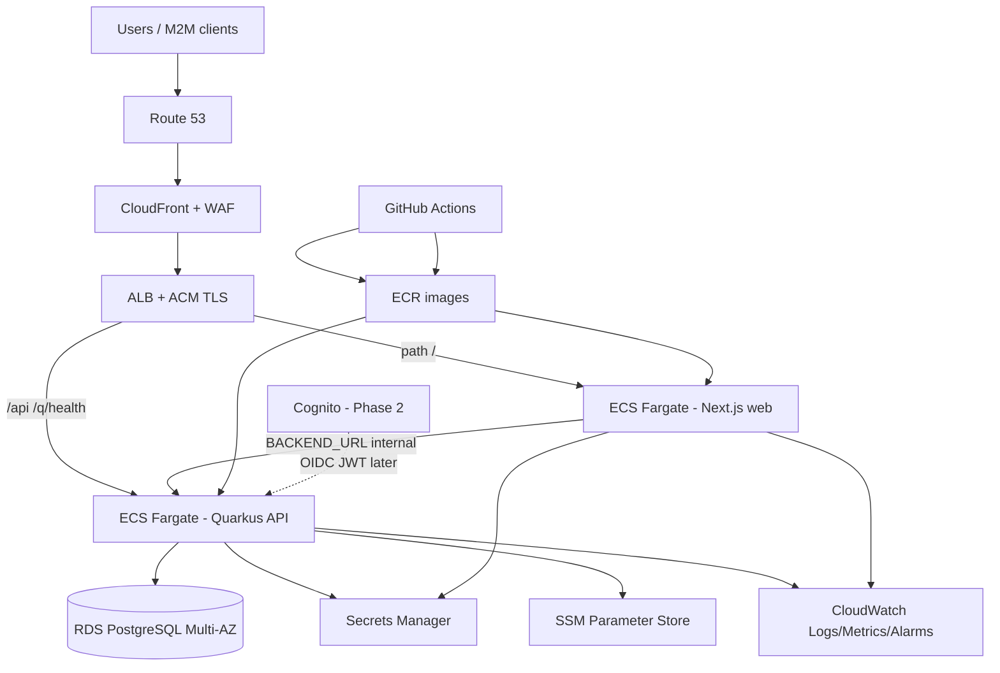

# InvoiceGenie AR — AWS Hosting Design

> **Status:** Design complete (implementation not started)  
> **Audience:** Engineering, product, ops, leadership  
> **Date:** 2026-07-24  
> **Repo:** InvoiceGenie (Quarkus multi-module Java 17 + Next.js web console)  
> **Related:** [PRODUCTION_READINESS.md](../PRODUCTION_READINESS.md), [FEATURE_PRIORITY_BACKLOG.md](../FEATURE_PRIORITY_BACKLOG.md), [PRODUCT_OWNER_STORIES.md](../PRODUCT_OWNER_STORIES.md) (STORY-003), [SCHEMA.md](../SCHEMA.md), [deploy/nginx-tls.conf](../deploy/nginx-tls.conf)

---

## 1. Executive summary & goals

### 1.1 Purpose

Host **InvoiceGenie AR** — a production-oriented multi-tenant Accounts Receivable platform — on AWS with:

- Secure multi-tenant isolation (application filter + PostgreSQL RLS)
- Managed Postgres with backups, encryption, and no public DB exposure
- TLS at the edge, secrets out of images/compose, centralized observability
- A path from today's Docker Compose / `Dockerfile.prod` stack to HA production
- Cost discipline for pilot tenants with a clear growth path

### 1.2 Goals (prod-ready multi-tenant AR)

| Goal | Success criteria |
|------|------------------|
| **Availability** | API + web 99.5%+ pilot; path to 99.9% with Multi-AZ |
| **Security** | Auth enabled (`invoicegenie.security.*`), TLS everywhere external, private RDS, WAF on public edge |
| **Tenancy** | `X-Tenant-Id` + API-key/JWT tenant binding; RLS GUC `app.current_tenant_id`; no cross-tenant reads |
| **Operability** | Health `/q/health`, metrics `/q/metrics`, JSON logs → CloudWatch, deploy/rollback runbooks |
| **Data durability** | RDS Multi-AZ (prod), automated backups, tested restore |
| **Migration** | Lift compose semantics (app / web / postgres) to AWS with minimal app code change |

### 1.3 Non-goals (initial)

- Multi-region active-active
- Full OIDC/RBAC (STORY-003) on day one — **designed for**, phased in
- MSK/Kafka as hard dependency — outbox-only until event consumers exist
- Schema-per-tenant or database-per-tenant (current model is shared DB + `tenant_id`)

---

## 2. Current system architecture summary

### 2.1 Modules (Maven reactor)

| Module | Role |
|--------|------|
| `shared-kernel` | `TenantId`, `Money`, `TenantContext`, `DbTenantContext` |
| `ar-domain` | Pure domain (invoices, payments, cheques, ledger, outbox ports) |
| `ar-application` | Use cases / inbound ports |
| `ar-adapter-api` | REST (JAX-RS), `AuthFilter`, `TenantFilter` |
| `ar-adapter-persistence` | JPA + Flyway migrations V1–V6, Agroal tenant interceptor |
| `ar-adapter-messaging` | Transactional outbox worker; optional Kafka sender |
| `ar-bootstrap` | Quarkus composition root (`application.yml`) |
| `web/` | Next.js standalone console; rewrites `/api/*` and `/q/*` → `BACKEND_URL` |

### 2.2 Runtime profiles & config knobs

From `ar-bootstrap/src/main/resources/application.yml`:

| Knob | Dev | Prod (`%prod` / `QUARKUS_PROFILE=prod`) |
|------|-----|----------------------------------------|
| DB | H2 mem (`%dev`) | PostgreSQL 15+ via `QUARKUS_DATASOURCE_*` |
| Schema | Hibernate `update` | Flyway `migrate-at-start: true`, `generation: none` |
| Security | `invoicegenie.security.enabled=false` | **enabled** (api-key or jwt) |
| OpenAPI | On | Swagger/OpenAPI **off** |
| Logs | File + plain console | Console JSON (`QUARKUS_LOG_CONSOLE_JSON`) |
| Outbox Kafka | `OUTBOX_KAFKA_ENABLED=false` | Optional; default keep false |
| Health | `/q/health` | Same (ECS/ALB probe target) |
| Metrics | `/q/metrics` (Prometheus) | Same |
| OTel | `QUARKUS_OTEL_ENABLED=false` | Opt-in → ADOT/X-Ray |

Compose mapping (`docker-compose.yml`):

- **app** — `Dockerfile.prod`, port 8080, health `curl /q/health`
- **web** — `web/Dockerfile` (Next standalone), port 3000, `BACKEND_URL=http://app:8080`
- **postgres** — 15-alpine (local only; AWS → RDS)

Web env:

- `BACKEND_URL` — server-side rewrite target (must be **internal** API URL on AWS)
- `NEXT_PUBLIC_ALLOW_TENANT_OVERRIDE` — **false** in prod
- `NEXT_PUBLIC_API_KEY` — optional browser key (prefer short-lived JWT/OIDC later)

### 2.3 Data flow (request)

```
Browser → Web (Next.js :3000)
            │ rewrites /api/*, /q/*
            ▼
         API (Quarkus :8080)
            │ AuthFilter (X-API-Key or Bearer JWT)
            │ TenantFilter (X-Tenant-Id + auth tenant bind)
            │ Use case → Domain → JPA
            │ DbTenantContext / Agroal interceptor → SET app.current_tenant_id
            ▼
         PostgreSQL (tenant_id + RLS)
            │
            └─ ar_outbox (same TX) → OutboxWorker → (optional Kafka)
```

### 2.4 Tenancy model

- **Storage:** Single database, `tenant_id UUID NOT NULL` on business tables (`docs/SCHEMA.md`)
- **App:** Every repository call is tenant-scoped; no bare `findById`
- **RLS:** Policy uses `current_setting('app.current_tenant_id')::uuid`
- **Headers:** `X-Tenant-Id` required; with auth enabled, mismatch with API-key/JWT tenant → **403**
- **Smoke tenant:** `00000000-0000-0000-0000-000000000001`

### 2.5 Auth state (today)

| Capability | Status |
|------------|--------|
| API-key gate (`X-API-Key`, format `key:tenantUuid`) | Implemented (`AuthFilter`, `ApiKeyRegistry`) |
| HS256 JWT with `tenant_id` claim | Implemented (mode `jwt`) |
| OIDC (Cognito/Auth0/Keycloak) | **Not implemented** |
| RBAC roles (`AR_CLERK`, `AR_CONTROLLER`, …) | **Not implemented** (STORY-003) |
| Actor → audit log | Partial / open |

**AWS design must support:** secrets for API keys/JWT secret now; Cognito JWT validation as Phase 2 without re-platforming.

### 2.6 Build artifacts

| Artifact | Source |
|----------|--------|
| API image | `Dockerfile.prod` → Temurin 17 JRE, `quarkus-run.jar`, `QUARKUS_PROFILE=prod` |
| Web image | `web/Dockerfile` → Next standalone `node server.js` |
| Migrations | Flyway under `ar-bootstrap/.../db/migration` (V1–V6) |
| CI | `.github/workflows/ci.yml` (mvn verify, web build, compose smoke) |

---

## 3. Target AWS reference architecture

### 3.1 High-level

```
                         Internet
                             │
                    ┌────────▼────────┐
                    │  Route 53 (DNS) │
                    └────────┬────────┘
                             │
              ┌──────────────┼──────────────┐
              │              │              │
       ┌──────▼──────┐ ┌─────▼─────┐  (optional)
       │ CloudFront  │ │  AWS WAF  │
       │  (web+API)  │ │  + Shield │
       └──────┬──────┘ └─────┬─────┘
              │              │
              └──────┬───────┘
                     │ HTTPS (ACM)
              ┌──────▼──────┐
              │     ALB     │  public subnets
              │ host/path   │
              └──────┬──────┘
         / ──────────┼────────── /api /q/health /q/metrics*
                     │
     ┌───────────────┼───────────────┐
     │ private app subnets           │
┌────▼─────┐                   ┌─────▼────┐
│ ECS Fargate│                 │ ECS Fargate│
│  service:  │  BACKEND_URL    │  service:  │
│  web :3000 │◄──internal DNS──│  api :8080 │
└───────────┘                  └─────┬─────┘
                                     │
                              ┌──────▼──────┐
                              │ RDS Postgres│  private data subnets
                              │ 15 Multi-AZ │
                              └─────────────┘
     Secrets Manager │ SSM │ CloudWatch │ (optional MSK later)
```

\* Prefer scrape metrics via private sidecar/collector or authenticated path; do not expose Prometheus publicly without auth.

### 3.2 Diagram assets

- Draw.io: [AWS_ARCHITECTURE.drawio](./AWS_ARCHITECTURE.drawio)
- PNG export: [AWS_ARCHITECTURE.png](./AWS_ARCHITECTURE.png) (when exported)
- Mermaid fallback: §3.3

### 3.3 Mermaid (portable)



---

## 4. Component mapping

### 4.1 Compute: recommendation

| Option | Fit for InvoiceGenie | Verdict |
|--------|----------------------|---------|
| **ECS Fargate** | JVM long-running Quarkus + Next.js SSR; VPC-native private RDS; matches `Dockerfile.prod` / `web/Dockerfile`; ALB health → `/q/health`; simple ops | **Primary (recommended)** |
| **EKS** | Strong if org already K8s-heavy; higher cost/ops for current team size | Defer until multi-service platform needs |
| **App Runner** | Easy for public single service; weaker for dual-service private VPC + RDS patterns and fine-grained networking | Reject as primary |
| **EC2 + Compose** | Closest to local; ops burden, patching, weaker elasticity | Dev/sandbox only |
| **Lambda** | Cold starts + long connections + Flyway-at-start poor fit for Quarkus JVM monolith | Reject |

**Decision:** **ECS on Fargate**, two services:

1. `invoicegenie-api` — image from `Dockerfile.prod`
2. `invoicegenie-web` — image from `web/Dockerfile`

Task sizing (starting points):

| Service | vCPU | Memory | Notes |
|---------|------|--------|-------|
| API | 1 vCPU | 2 GB | Aligns with `MaxRAMPercentage=75.0` in Dockerfile.prod; raise to 2/4GB under load |
| Web | 0.5 vCPU | 1 GB | Next standalone is light |

**Autoscaling:** target tracking on ALB `RequestCountPerTarget` and/or ECS CPU 60%. Min 2 tasks (prod API) across AZs.

### 4.2 API (Quarkus JVM)

| Concern | AWS mapping |
|---------|-------------|
| Listener | ALB target group, port **8080**, protocol HTTP (TLS terminates at ALB/CloudFront) |
| Health | ALB health check path **`/q/health`**, matcher 200, interval 30s, healthy threshold 2; grace period ≥ 60s (compose uses 60s start_period) |
| Readiness | Prefer Quarkus readiness group if split; start with liveness=`/q/health` |
| Config | Task env + Secrets Manager injection (see §4.7) |
| Flyway | `QUARKUS_FLYWAY_MIGRATE_AT_START=true` — **only one writer** during migrate; for multi-task deploys use rolling with care or a one-off migrate task (see roadmap P1) |
| Swagger | Disabled in `%prod` — still block `/q/swagger-ui`, `/q/openapi` at ALB/WAF (parity with `docs/deploy/nginx-tls.conf`) |
| Metrics | Container scrape or CloudWatch agent; path `/q/metrics` **internal only** |

**Critical env (API task):**

```
QUARKUS_PROFILE=prod
QUARKUS_DATASOURCE_JDBC_URL=jdbc:postgresql://<rds-endpoint>:5432/invoicegenie
QUARKUS_DATASOURCE_USERNAME=...
QUARKUS_DATASOURCE_PASSWORD=...   # from Secrets Manager
INVOICEGENIE_SECURITY_ENABLED=true
INVOICEGENIE_SECURITY_MODE=api-key   # or jwt
INVOICEGENIE_API_KEYS=...            # secret
INVOICEGENIE_JWT_SECRET=...          # secret if jwt mode
INVOICEGENIE_SECURITY_ALLOW_OPENAPI=false
OUTBOX_KAFKA_ENABLED=false           # until MSK
QUARKUS_LOG_CONSOLE_JSON=true
QUARKUS_HTTP_HOST=0.0.0.0
```

### 4.3 Web (Next.js)

| Concern | Choice | Rationale |
|---------|--------|-----------|
| Hosting | **ECS Fargate** (not pure S3) | `next.config.ts` uses **server rewrites** to `BACKEND_URL` for `/api/*` and `/q/*`; standalone `node server.js` needs a runtime |
| CDN | **CloudFront** in front of ALB (or CF → web origin only, API separate) | TLS, caching static `_next/static`, WAF attachment |
| S3 | Optional for pure static assets only | Not sufficient alone while rewrites/SSR remain |
| `BACKEND_URL` | Internal service discovery: `http://invoicegenie-api.<namespace>:8080` **or** ALB internal listener URL | Must not point at public internet from web→API if avoidable |
| Tenant override | `NEXT_PUBLIC_ALLOW_TENANT_OVERRIDE=false` | Prod requirement from PRODUCTION_READINESS |
| API key | Prefer server-side session later; until then carefully managed `NEXT_PUBLIC_API_KEY` or drop public key and use login | STORY-003 |

**SSR consideration:** Browser stays same-origin to the web host; Next server proxies to Quarkus. On AWS, keep web and API in the same VPC; set `BACKEND_URL` to the **private** API service DNS (Cloud Map / ECS Service Connect) rather than the public ALB when possible (reduces hop + public attack surface).

**Recommended traffic split on ALB:**

| Rule | Target |
|------|--------|
| `/api/*` | API service |
| `/q/health` | API service (probes + external uptime) |
| `/q/*` (other) | Block or API (metrics not public) |
| `/*` | Web service |

Alternatively: CloudFront behaviors: default → web; `/api/*` → ALB API target. Then web's `BACKEND_URL` still uses internal API for server-side rewrites.

### 4.4 Data: RDS PostgreSQL

| Setting | Recommendation |
|---------|----------------|
| Engine | **PostgreSQL 15** (matches compose `postgres:15`) |
| Deploy | **Multi-AZ** for prod; Single-AZ acceptable for dev |
| Instance (pilot) | `db.t4g.medium` or `db.t4g.small` |
| Instance (growth) | `db.r6g.large`+ as connections/CPU grow |
| Storage | gp3, encrypted, autoscaling (start 50–100 GB) |
| Backups | Automated 7–35 days; copy snapshots to vault account optional |
| Encryption | Storage encryption **KMS** CMK |
| Network | Private subnets only; SG allows 5432 **from API tasks SG only** |
| Params | Parameter group: force SSL `rds.force_ssl=1`; tune `max_connections` vs pool `QUARKUS_DATASOURCE_JDBC_MAX_SIZE` (default 32) |
| Users | App user ≠ master; least privilege on `invoicegenie` DB |
| Migrations | App Flyway at start **or** CI migrate job using same migrations classpath |

**Do not** map RDS to public subnets or open 5432 to `0.0.0.0/0`.

### 4.5 Messaging

| Option | When |
|--------|------|
| **Outbox-only** (`OUTBOX_KAFKA_ENABLED=false`) | **Initial production** — worker still processes `ar_outbox`; no external broker cost |
| **Amazon MSK** | When external consumers need `ar.domain.events` |
| **Amazon MQ** | Prefer only if needing classic JMS; not aligned with current Kafka-oriented sender |

Config already present:

- `outbox.kafka.bootstrap-servers` ← `KAFKA_BOOTSTRAP_SERVERS`
- `outbox.kafka.topic` ← `OUTBOX_KAFKA_TOPIC` (default `ar.domain.events`)

**Decision:** Ship P0/P1 AWS **without MSK**. Enable MSK in P2 when product has a real consumer (GL, dunning, webhooks dispatch worker).

### 4.6 Secrets & config

| Store | Use for |
|-------|---------|
| **Secrets Manager** | `QUARKUS_DATASOURCE_PASSWORD`, `INVOICEGENIE_API_KEYS`, `INVOICEGENIE_JWT_SECRET`, RDS master (bootstrap) |
| **SSM Parameter Store** | Non-secret: `QUARKUS_DATASOURCE_JDBC_URL` host, feature flags, `OUTBOX_KAFKA_ENABLED`, log levels |
| **ECS secrets injection** | Map SM ARNs to container env at task definition |

Never bake secrets into images or CloudFormation defaults. Rotate API keys by updating secret + force new deployment.

### 4.7 Auth on AWS (maps to STORY-003)

**Phase A — now (matches code):**

- `INVOICEGENIE_SECURITY_ENABLED=true`
- Mode `api-key` for M2M and console smoke
- Optional mode `jwt` with HS256 secret in Secrets Manager
- Tenant binding already enforced in `TenantFilter` when auth present

**Phase B — STORY-003 RBAC + OIDC:**

| Piece | AWS |
|-------|-----|
| IdP | **Amazon Cognito** User Pool (or external OIDC) |
| App clients | Web (public + PKCE) and M2M (client credentials) |
| Groups/roles | Cognito groups → JWT `cognito:groups` or custom `roles[]`: `AR_CLERK`, `AR_CONTROLLER`, `AR_AUDITOR`, `TENANT_ADMIN` |
| Quarkus | Prefer `quarkus-oidc` validating Cognito JWKS (post Quarkus LTS migration); until then custom filter extension |
| Tenant claim | Custom attribute `custom:tenant_id` or group→tenant map; must align with `X-Tenant-Id` policy |
| API keys | Retain for integrations only; not browser primary auth |

**Phase C — Web:**

- Next.js auth session (Auth.js / Cognito Hosted UI)
- `NEXT_PUBLIC_ALLOW_TENANT_OVERRIDE=false`
- Remove long-lived `NEXT_PUBLIC_API_KEY` from browser

### 4.8 Network

```
VPC 10.0.0.0/16
├── Public subnets (3 AZ): ALB, NAT GW (1 per AZ prod; 1 NAT pilot OK)
├── Private app subnets (3 AZ): ECS tasks
└── Private data subnets (3 AZ): RDS (no NAT required)
```

Security groups:

| SG | Ingress | Egress |
|----|---------|--------|
| `alb-sg` | 443 from CloudFront prefix list or 0.0.0.0/0 (if no CF lock) | to web-sg:3000, api-sg:8080 |
| `web-sg` | 3000 from alb-sg | to api-sg:8080, 443 for npm N/A at runtime |
| `api-sg` | 8080 from alb-sg + web-sg | to rds-sg:5432, 443 (AWS APIs, OIDC JWKS) |
| `rds-sg` | 5432 from api-sg only | none needed |

**No public RDS.** Optional VPC endpoints: Secrets Manager, ECR, CloudWatch Logs, S3 (reduce NAT cost).

### 4.9 TLS

| Layer | Mechanism |
|-------|-----------|
| Public | **ACM** certificate on ALB and/or CloudFront |
| Redirect | HTTP→HTTPS on ALB listener rules (parity with nginx conf) |
| RDS | Require SSL; JDBC URL may include `sslmode=require` |
| Internal ALB→tasks | HTTP inside VPC acceptable; mTLS optional later |

### 4.10 Observability

| Signal | Implementation |
|--------|----------------|
| Logs | ECS `awslogs` driver → CloudWatch log groups `/invoicegenie/{env}/api`, `.../web`; JSON from prod profile |
| Metrics | Container Insights; ALB metrics; scrape `/q/metrics` via AMP or CW agent (private) |
| Traces | `QUARKUS_OTEL_ENABLED=true` + ADOT sidecar or OTLP to X-Ray / AMP |
| Alarms | 5xx rate, unhealthy hosts, RDS CPU/storage/connections, ECS CPU/mem, Flyway fail = task crash loops |
| Dashboards | API latency (ALB target response), error rate, outbox lag (custom metric later) |

### 4.11 CI/CD

Extend existing GitHub Actions (`.github/workflows/ci.yml`):

```
push main →
  mvn verify
  npm ci && lint && build
  docker build -f Dockerfile.prod → push ECR api
  docker build web/ → push ECR web
  (optional) Trivy/ECR scan
  deploy ECS new task definition (staging auto; prod manual approval)
```

OIDC federation: GitHub OIDC → IAM role (no long-lived AWS keys in GitHub).

Deploy strategy: **rolling** ECS deployment, circuit breaker with rollback enabled.

### 4.12 WAF, Shield, rate limits

- **AWS WAF** on CloudFront (preferred) or ALB: AWS Managed Rules (Common, Known Bad Inputs), rate-based rule on `/api/*`
- **Shield Standard** (default) — DDoS baseline
- Block `/q/swagger-ui`, `/q/openapi` at WAF/ALB
- Consider geo rules if product is regional

---

## 5. Multi-tenant isolation on AWS

| Layer | Control |
|-------|---------|
| **Identity** | API key or JWT bound to tenant; Cognito `custom:tenant_id` later |
| **Transport** | HTTPS; no unauthenticated public API when security enabled |
| **Application** | `TenantFilter` + repositories require `TenantId` |
| **Database** | RLS + `tenant_id` columns; GUC set per connection (Agroal interceptor) |
| **Network** | Shared VPC (not tenant-per-VPC); isolation is logical, not network-partitioned |
| **Secrets** | Per-env secrets; optional per-tenant API keys in SM JSON map |
| **Observability** | Log `tenant_id` (careful with PII); metric dimensions by tenant for noisy neighbors later |
| **Admin** | Tenant registry API must be **TENANT_ADMIN / platform admin** only once RBAC lands |

**Not recommended initially:** separate RDS per tenant (ops explosion). Revisit for mega-tenants / compliance isolation.

---

## 6. Security & compliance baseline

| Control | Implementation |
|---------|----------------|
| Encryption in transit | TLS 1.2+ at CloudFront/ALB; RDS SSL |
| Encryption at rest | RDS KMS, EBS (Fargate ephemeral), Secrets Manager, ECR encryption |
| Least privilege IAM | Task roles: only `secretsmanager:GetSecretValue` for named secrets, `logs:*` limited, no `*` |
| AuthZ | Phase A api-key/jwt; Phase B Cognito groups + resource checks (STORY-003) |
| Audit | App `ar_audit_log` + CloudTrail (AWS API) + ALB access logs → S3 |
| Secrets | No defaults in prod; fail closed if `INVOICEGENIE_SECURITY_ENABLED` false in prod (app should enforce; ops should also gate) |
| Dependency CVEs | Existing `security.yml` + ECR scanning |
| Postgres exposure | Private only |
| Edge lockdown | OpenAPI blocked; WAF rate limits |
| Quarkus platform | **P0 risk:** on EOL 3.8.6.1 — migrate per `docs/QUARKUS_LTS_MIGRATION.md` before or in parallel with prod |

---

## 7. Environments & account strategy

| Approach | Recommendation |
|----------|----------------|
| **Pilot** | Single AWS account, isolated VPCs: `dev`, `staging`, `prod` |
| **Growth** | AWS Organizations: `invoicegenie-dev`, `invoicegenie-staging`, `invoicegenie-prod` + shared services (DNS, security tooling) |
| **IAM** | SSO via IAM Identity Center; no shared human long-term access keys |
| **State** | Terraform state in S3 + DynamoDB lock **per account/env** |

| Env | Size | Security | Data |
|-----|------|----------|------|
| dev | 1 API + 1 web task, RDS single-AZ small | API keys OK | Synthetic |
| staging | 2 API tasks, Multi-AZ optional | Prod-like secrets/auth | Anonymized subset |
| prod | ≥2 API + ≥2 web, RDS Multi-AZ | Full WAF, no tenant override, no OpenAPI | Live |

Promote images by **digest**, not just `latest`.

---

## 8. Cost estimate ranges (USD, order-of-magnitude, us-east-1)

> Indicative only — validate with [AWS Pricing Calculator](https://calculator.aws/). Multi-AZ roughly doubles RDS compute/storage cost vs single-AZ. [web:0][web:2]

### 8.1 Small pilot (1–3 tenants, low traffic)

| Component | Config | Monthly ballpark |
|-----------|--------|------------------|
| ECS Fargate API | 1–2 × 1vCPU/2GB | $30–80 |
| ECS Fargate Web | 1–2 × 0.5vCPU/1GB | $15–40 |
| ALB | 1 | $20–30 + LCU |
| RDS Postgres | db.t4g.small/medium Single-AZ → Multi-AZ | $40–150 |
| NAT Gateway | 1 AZ | $35–45 + data |
| CloudFront + WAF | low traffic | $5–30 |
| Secrets/SSM/Logs | | $5–20 |
| **Total pilot** | | **~$150–400** |

### 8.2 Growth (many tenants, HA)

| Component | Config | Monthly ballpark |
|-----------|--------|------------------|
| ECS | 4–8 API tasks, 2–4 web | $150–400 |
| RDS | db.m6g.large Multi-AZ + storage | $300–500+ [web:2] |
| NAT | 2–3 AZ | $100–150 |
| MSK (if enabled) | small cluster | $150–400+ |
| Observability | AMP/X-Ray/extra logs | $50–150 |
| **Total growth** | | **~$800–2,500** |

**Cost levers:** 1 NAT in pilot; VPC endpoints for ECR/SM/Logs; outbox-only (no MSK); right-size RDS; Savings Plans/Fargate Spot for non-prod.

---

## 9. Migration / cutover plan from local Docker

### 9.1 Prep

1. Freeze schema: ensure Flyway V1–V6 applied cleanly on empty Postgres 15
2. Build and push `Dockerfile.prod` + `web/Dockerfile` to ECR
3. Create Secrets Manager secrets mirroring `.env.example` keys
4. Provision VPC, RDS, ECS cluster (empty)
5. Run API task once against empty RDS → Flyway migrates
6. Seed tenants/API keys for pilot

### 9.2 Data migration (if local/prod-like DB exists)

1. `pg_dump` source → restore to RDS (maintenance window)
2. Or dual-write not needed for greenfield
3. Validate row counts per tenant, RLS smoke (cross-tenant 404/empty)

### 9.3 Cutover

1. Staging soak: smoke script `scripts/test-api.sh` with `X-API-Key` + `X-Tenant-Id`
2. DNS: Route 53 → CloudFront/ALB
3. Monitor 5xx, health, RDS connections
4. Rollback: previous ECS task definition + DNS TTL kept low (60–300s) during cutover

### 9.4 Decommission local compose for prod use

Compose remains **dev/demo only** (as documented in PRODUCTION_READINESS).

---

## 10. Phased implementation roadmap

### P0 — Foundation (MVP cloud)

- [ ] AWS account + IAM Identity Center + OIDC for GitHub
- [ ] VPC (public/private/data), NAT, SGs
- [ ] RDS Postgres 15 (start Single-AZ if budget; Multi-AZ before real customers)
- [ ] ECR repos + push from CI
- [ ] ECS cluster, API + web services, ALB, ACM
- [ ] Secrets Manager wiring for all `INVOICEGENIE_*` and DB password
- [ ] CloudWatch logs + basic alarms (unhealthy host, 5xx)
- [ ] WAF rate limit + block OpenAPI paths
- [ ] Staging environment live with security enabled

### P1 — HA & production hardening

- [ ] RDS Multi-AZ, backup retention, restore drill
- [ ] Min 2 tasks API/web across AZs; autoscaling policies
- [ ] CloudFront in front of ALB
- [ ] VPC endpoints (ECR, Secrets Manager, Logs)
- [ ] Controlled Flyway strategy for multi-task deploys
- [ ] Metrics pipeline for `/q/metrics`
- [ ] Runbooks executed once (backup restore, rollback)
- [ ] Quarkus LTS migration (P0-03) completed

### P2 — Advanced platform

- [ ] Cognito OIDC + RBAC (STORY-003 roles)
- [ ] Optional MSK + `OUTBOX_KAFKA_ENABLED=true`
- [ ] OTel → X-Ray/ADOT
- [ ] Multi-account Organizations
- [ ] Read replica for heavy aging/report queries
- [ ] Native image evaluation (P3 backlog) for faster scale-out

---

## 11. Risks & mitigations

| Risk | Impact | Mitigation |
|------|--------|------------|
| **Quarkus 3.8 EOL** | Unpatched CVEs | Prioritize `docs/QUARKUS_LTS_MIGRATION.md` before broad production |
| **Auth gaps / no RBAC** | Privilege misuse, tenant spoofing if override on | Force security on; disable tenant override; ship STORY-003; never expose unauthenticated API |
| **API keys in browser** (`NEXT_PUBLIC_API_KEY`) | Key leakage | Short term: restrict WAF + rotate; long term: Cognito sessions |
| **Flyway on every task start** | Race / lock contention on multi-task deploy | Serialize deploy, or migrate job then start app with migrate-at-start false after baseline |
| **Connection pool vs RDS max_connections** | Exhaustion under scale-out | `max-size` 32 × tasks must fit RDS; use RDS Proxy if many tasks |
| **Outbox without Kafka** | Events not externally consumable | Accept for MVP; monitor outbox table growth; enable MSK when needed |
| **NAT cost** | Bill shock | Single NAT pilot; endpoints; monitor |
| **Secrets in git/history** | Breach | SM only; rotate if ever committed |
| **RLS mis-set under pool** | Cross-tenant leak | Already mitigated by Agroal interceptor — regression-test in staging |
| **OpenAPI left on** | Attack surface | `%prod` disables; ALB/WAF deny as belt-and-suspenders |

---

## 12. Runbooks outline

### 12.1 Deploy

1. CI green on commit SHA  
2. Images tagged `sha-<git>` in ECR  
3. Update ECS task defs (secrets unchanged unless rotation)  
4. ECS rolling deploy; watch deployment circuit breaker  
5. Smoke: `GET /q/health`, create customer + invoice with tenant headers  
6. Confirm Flyway version in logs / `flyway_schema_history`

### 12.2 Rollback

1. ECS UpdateService → previous task definition revision  
2. If bad migration: restore RDS to snapshot **before** migrate (forward-only Flyway preferred; write reversible migrations carefully)  
3. Invalidate CloudFront if web assets cached wrong

### 12.3 Backup & restore

1. Automated RDS snapshots daily  
2. Restore drill quarterly to staging  
3. App point-in-time: restore new instance, re-point secret JDBC URL, redeploy API

### 12.4 Incident (5xx / unhealthy)

1. Check ALB target health + ECS stopped task reasons  
2. CloudWatch logs: JSON errors, datasource, security misconfig  
3. RDS CPU/connections/storage  
4. Scale out API or reboot unhealthy tasks  
5. If tenant isolation suspected: freeze deploys, audit queries with wrong GUC, rotate API keys

### 12.5 Secret rotation

1. Put new value in Secrets Manager  
2. Force new ECS deployment  
3. Invalidate old API keys in registry map

---

## 13. PR / implementation plan (IaC checklist)

Prefer **Terraform** (team-portable). CDK acceptable if org standard.

See skeleton: [terraform/README.md](./terraform/README.md)

### Module checklist

| Module | Contents |
|--------|----------|
| `modules/network` | VPC, subnets, NAT, route tables, flow logs |
| `modules/security` | SGs, WAF WebACL, KMS keys |
| `modules/data` | RDS, subnet group, param group, secrets for master |
| `modules/ecr` | api + web repositories, lifecycle policies |
| `modules/ecs` | Cluster, task defs, services, roles, Service Connect/Cloud Map |
| `modules/alb` | ALB, listeners, target groups, rules, ACM attach |
| `modules/cdn` | CloudFront distribution, behaviors |
| `modules/observability` | Log groups, alarms, dashboard |
| `modules/cicd-iam` | GitHub OIDC provider + deploy roles |
| `envs/dev|staging|prod` | Root modules composing above |

### Application PRs (repo, not pure IaC)

1. Ensure prod fails closed if security secrets are `none` (hardening)  
2. Document AWS env vars in `.env.example` AWS section  
3. GitHub workflow `deploy-aws.yml` (ECR push + ECS update)  
4. Optional: split readiness vs liveness if needed  
5. STORY-003 OIDC integration PR series  

### Acceptance for “AWS ready”

- [ ] Staging URL serves web + authenticated API  
- [ ] RDS not publicly accessible (Security Hub / manual check)  
- [ ] Restore tested once  
- [ ] Alarms page ops  
- [ ] Runbooks linked from this doc  

---

## 14. Open questions (product / ops)

1. **OIDC timeline:** Is Cognito mandatory for first external pilot, or is API-key sufficient for a closed beta?  
2. **Domain names:** Production hostname(s) for console vs API (`ar.example.com` vs `api.ar.example.com`)?  
3. **Compliance:** Any SOC2/ISO/PCI scope that forces dedicated accounts, private CA, or longer audit retention?  
4. **Kafka:** Any near-term GL/AP consumer that requires MSK in P1?  
5. **Region:** Primary region and DR region requirements?  
6. **Budget ceiling:** Confirm pilot <$400/mo vs HA growth band.  
7. **Data residency:** Single-region only, or multi-country tenants?  
8. **Who owns Flyway in deploy:** app-at-start vs CI migrate job?

---

## 15. Document control

| Version | Date | Notes |
|---------|------|-------|
| 1.0 | 2026-07-24 | Initial AWS hosting design from codebase audit |

**Next steps:** Execute [AWS_DEPLOYMENT_CHECKLIST.md](./AWS_DEPLOYMENT_CHECKLIST.md) P0 items; implement Terraform modules per [terraform/README.md](./terraform/README.md).
